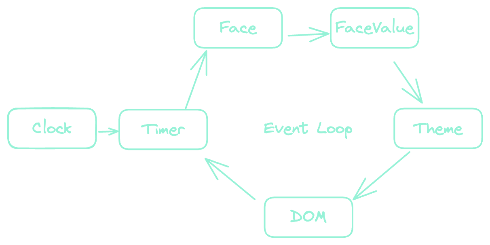

# Core Concepts

[[toc]]

## Event Loop

The `Clock` uses the `Timer` to run an event loop which gets a `FaceValue` from the `Face` that is rendered by the `Theme` and the DOM updates. \
 \
 \
 

## Core Components

### Clock

Think of a clock in the real world. The "clock" is the housing for the buttons, has an internal timer, batteries with one or many functions. Each clock has a unique interface and appearance. Using this metaphor, the `FlipClock` instance is the "clock". 

### Face

The clock `Face` determines the behavior and functionality. Some clocks display time in 12 hours, and others use a 24 hour format. A stop watch displays elapsed time. A train station flipboard has alphanumberic characters that show arrivals and destinations All of these are different "faces" for how a "clock" can display different information. The value that displays on the clock is a `FaceValue`.

### FaceValue

`FaceValue`'s allow you to pass arbitrary data so it can be displayed in the clock. The `FaceValue` is responsible for digitizing and undigitizing the data which is used by the `Face`. Each face can implement the `FaceValue` however it wants. Some faces for example have multiple values.

### Theme

Like a real clock, a `Face` may be rendered into whatever appearance you desite. The `Theme` determines how the `Face` is rendered. The `Theme` is more than just CSS. The `Theme` also renders the clock in the DOM. So each `Theme` can have accompanying CSS, however a theme doesn't have any CSS. A theme is capable of rendering any `Face` due to the `Face` digitizing itself into a `FaceValue`, which is displayed in the browser.

### CSS

FlipClock.js offers a comprehensive CSS-in-JS solution for overriding the default CSS, creating your own CSS for a new theme, or to use however you want to change the CSS of the clock. However, if you prefer to use old-school CSS, or SCSS, or Postcss, you can still import `.css` file if you prefer. Keeping the CSS in inside your JS has its advantages and disadvantages because it is bundled your JS file, so choose the best option.

### Face vs Theme vs CSS

The `Face` determines the behavior, any public methods and is responsible for formatting and changing the `FaceValue` with each tick of the event loop. The `Theme` determines how a `Face` will be rendered (the HTML). The `CSS` styles the markup rendered by the `Theme`.
